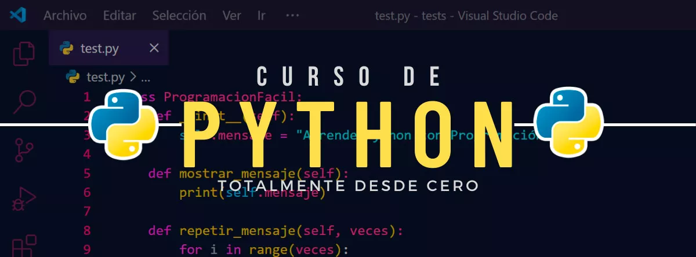
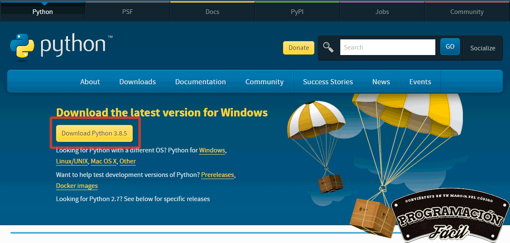
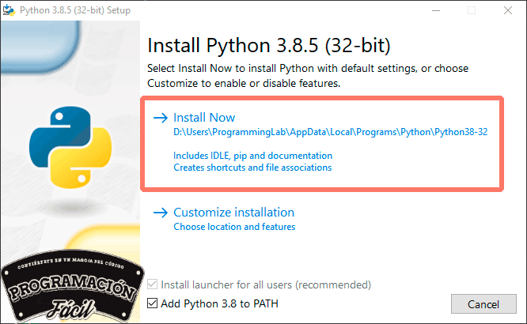
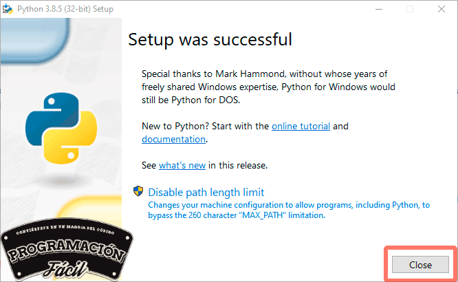
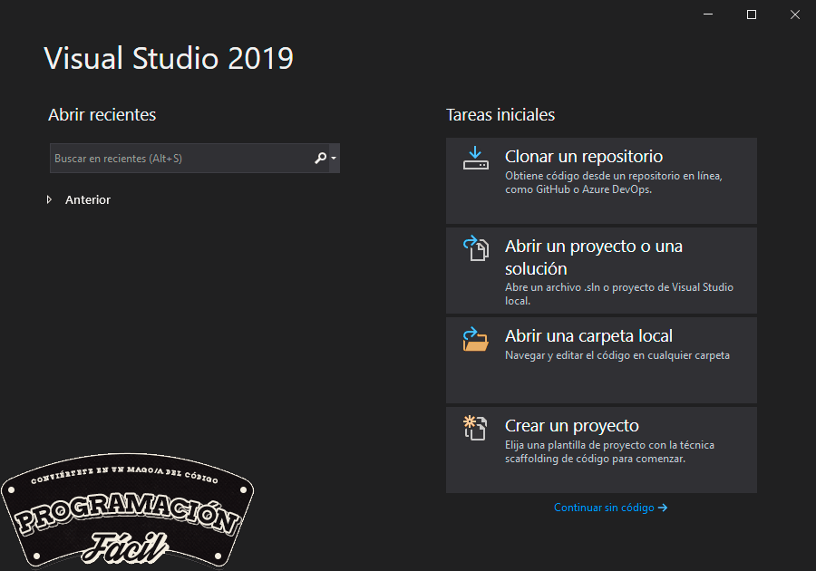

# JoseLuisVillarSanchez-IA_P1
Instalacion de Python 

Cómo instalar Python y un IDE para programar

Instalación de Python y un IDE para programar

Capítulo 1: Cómo instalar  Python y un  IDE

https://www.youtube.com/watch?v=Jdb1dC8usFo

Empezamos el curso con la instalación de Python y un IDE (entorno de desarrollo integrado) para poder programar.

Para instalar el intérprete de Python en tu PC, solo tienes que ir a la página oficial de descargas de Python y descargar la versión que prefieras, así de simple.
Para descargar Python, lo primero que debemos hacer es ir a la página oficial de Python, nunca te lo descargues de otros sitios, sobretodo, si no los conoces.

Descargar Python

https://www.python.org/downloads/

Una vez terminada la descarga, ejecuta el instalador y haz click en "Install Now" dejando las opciones de abajo marcadas.
Si quieres cambiar la carpeta donde se va a instalar, tendrás que hacerlo en "Customize installation".

Una vez terminada la instalación deberás hacer click en el botón "Close" para finalizar.

Y con estos simples pasos, ya tendrás Python instalado en tu PC.
Para terminar, necesitarás un IDE para poder seguir el curso. En este curso, voy a utilizar Visual Studio Community que es gratuito y fácil de usar. Tú puedes utilizar cualquier otro, pregunta en los comentarios si quieres que te dé algunas alternativas según tu caso.

Descargar Visual Studio Community

https://visualstudio.microsoft.com/es/thank-you-downloading-visual-studio/?sku=Community

Realiza la instalación por defecto y ya podrás empezar a programar en Python sin problemas.

